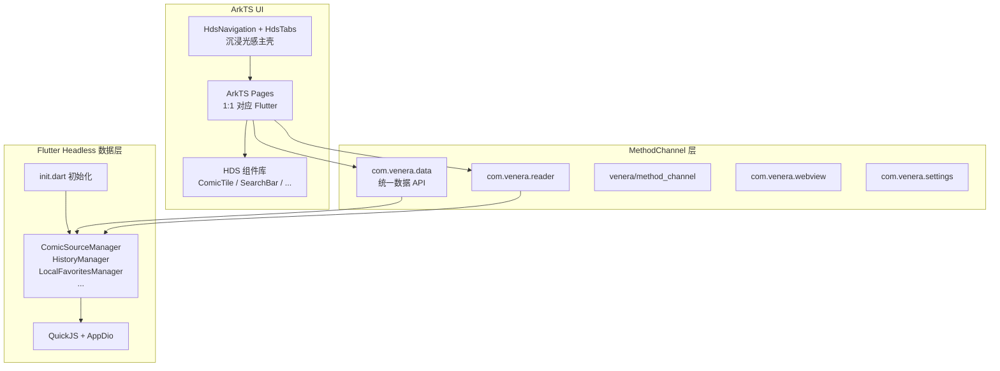

# Venera HarmonyOS

[Venera](https://github.com/venera-app/venera) 漫画阅读器的 HarmonyOS 移植版。`HDS_UI` 分支正在将 UI 全量 1:1 迁移至 ArkTS/ArkUI（HarmonyOS 6.1 API 23 沉浸光感材质），同时保留 Flutter 数据层（QuickJS 漫画源、SQLite、Dio、Manager 单例）。

## 功能特性

- 多源漫画浏览与搜索
- 漫画阅读器（6 种阅读模式：画廊左右/右左/上下、连续上下/左右/右左）
- 内置 WebView（支持 Cloudflare 验证绕过）
- 生物认证 / 密码锁（人脸识别 / 指纹识别 + PIN 回退）
- 漫画下载与本地管理
- 收藏与阅读历史
- WebDAV 数据同步
- 动态配色 / 主题切换
- 多语言支持（中文简繁、英文）

## 分支策略

| 分支 | 用途 |
|------|------|
| `main` | 稳定线，Flutter UI + 数据层混合架构，可随时回退 |
| `HDS_UI` | ArkUI 1:1 迁移开发分支，执行全量 UI 迁移计划 |

```bash
git checkout main      # 稳定版（Flutter UI）
git checkout HDS_UI    # 迁移开发（ArkUI + HDS）
```

远程仓库：[https://github.com/Twopuding/venera-harmony](https://github.com/Twopuding/venera-harmony)

迁移工作仅在 `HDS_UI` 提交；全量验收通过后合并至 `main`。

## 迁移进度

| 阶段 | 内容 | 状态 |
|------|------|------|
| Phase 0 | Flutter headless 入口、`DataBridge` 双端桥接、Reader 桥接修复、`HdsTheme` 设计系统、HDS 组件升级 | ✅ 已完成 |
| Phase 1 | `MainShell`（HdsNavigation + HdsTabs）主壳；Home / Explore / Search / ComicDetails / Reader 核心路径 | 🚧 进行中 |
| Phase 2 | 收藏、分类、本地、历史、图片收藏 | 待开始 |
| Phase 3 | 设置、认证、漫画源、WebView | 待开始 |
| Phase 4 | 默认原生 UI、移除 Flutter 页面、文档与回归测试 | 待开始 |

在 `HDS_UI` 分支中，设置 `useNativeUi = true` 可启用 ArkUI 主壳；设为 `false` 则回退至 Flutter UI。

## 架构

`EntryAbility` 仍继承 `FlutterAbility`，保证 Flutter Engine 与 FFI（sqlite3 / qjs）生命周期。启用原生 UI 时，Dart 侧以 headless 模式运行（`runApp(const SizedBox.shrink())`），仅注册 MethodChannel Handler，不渲染 Material UI。



| 层级 | 技术 | 职责 |
|------|------|------|
| UI（迁移目标） | ArkTS / ArkUI + HDS | 全部页面、沉浸光感主壳、原生组件库 |
| UI（回退） | Flutter (Dart) | `useNativeUi = false` 时渲染 Material UI |
| 数据层 | Flutter (Dart) | 漫画源管理、搜索、下载、设置、SQLite、QuickJS |
| 阅读器 | 原生 ArkTS | 6 种阅读模式、手势交互、沉浸式全屏 |
| WebView | 原生 ArkTS | Cloudflare 验证、Cookie 提取 |
| 设置 / 认证 | 原生 ArkTS | 生物认证、文件选择、屏幕常亮 |
| JS 引擎 | QuickJS (C/FFI) | 漫画源脚本执行 |
| 数据存储 | SQLite3 (C/FFI) | 本地数据库 |
| 通信 | MethodChannel | ArkTS ↔ Dart 双向调用 |

### HDS 设计系统

基于 `@kit.UIDesignKit`（API 23）：

- **主壳**：`HdsNavigation` + `HdsTabs`，`barFloatingStyle` + `systemMaterialEffect`
- **材质**：默认 `ADAPTIVE`；设备不支持 `IMMERSIVE` 时降级为 `SMOOTH`
- **主题**：[`HdsTheme.ets`](apps/app_ohos/ohos/entry/src/main/ets/design/HdsTheme.ets) 对齐 Flutter `SeedColorScheme` 与系统 `$r('sys.color.*')`
- **组件**：`ComicTile`、`ComicGrid`、`SearchBar`、`BlurCard`、`ImmersiveNavBar` 等已升级 HDS 材质

### 通信通道

| 通道名 | 方向 | 用途 |
|--------|------|------|
| `com.venera.data` | ArkTS → Dart | 统一数据 API（探索、搜索、收藏、历史、下载、设置等） |
| `com.venera.data/events` | Dart → ArkTS | 事件推送（`settingsChanged`、`downloadProgress` 等） |
| `com.venera.reader` | ArkTS ↔ Dart | 阅读器数据加载、章节图片、历史更新 |
| `com.venera.webview` | Dart → ArkTS | 打开 WebView |
| `com.venera.settings` | Dart ↔ ArkTS | 认证、文件选择、屏幕控制 |
| `venera/method_channel` | Dart ↔ ArkTS | 通用平台服务（URL 打开、分享、电量、代理等） |

ArkTS 侧通过 [`DataService.ets`](apps/app_ohos/ohos/entry/src/main/ets/service/DataService.ets) 封装 Promise 风格 API；Dart 侧 Handler 注册于 [`native_ui_bootstrap.dart`](apps/app_ohos/lib/bridge/native_ui_bootstrap.dart)。

**DataBridge 方法分组（节选）：**

| 域 | 方法示例 | 对应 Flutter Manager |
|----|----------|---------------------|
| 探索 / 搜索 | `exploreLoadPage`, `search`, `aggregatedSearch` | `ComicSource`, `ExplorePageData` |
| 漫画详情 | `loadComicInfo`, `loadComments`, `loadChapters` | `ComicSource.loadComicInfo` |
| 收藏 | `getFolders`, `getComics`, `addFavorite` | `LocalFavoritesManager` |
| 历史 / 本地 | `getHistory`, `getLocalComics`, `deleteLocal` | `HistoryManager`, `LocalManager` |
| 下载 | `getDownloadTasks`, `startDownload`, `cancelDownload` | `DownloadManager` |
| 设置 | `getSettings`, `setSetting`, `getComicSources` | `appdata`, `ComicSourceManager` |

## 生物认证

基于 HarmonyOS `@kit.UserAuthenticationKit` 实现：

- **权限**：`ohos.permission.ACCESS_BIOMETRIC`（system_grant）
- **认证流程**：
  1. 用户可在设置中选择「人脸识别」或「指纹识别」作为首选认证方式
  2. 认证时先尝试所选的生物认证方式（ATL2）
  3. 生物认证界面提供「使用密码」导航按钮，点击后回退到 PIN 码验证（ATL1）
- **API**：`getUserAuthInstance(AuthParam, WidgetParam)`（API 10+）
- **错误处理**：认证失败返回 401 时自动降级

## 前置条件

| 项目 | 版本要求 |
|------|----------|
| Flutter ohos SDK | `3.22.4-ohos-1.1.4-beta` |
| Dart SDK | `>=3.4.4 <4.0.0` |
| DevEco Studio | `>=5.0` |
| HarmonyOS SDK | `>=5.0.0(12)`，target `6.1.0(23)` |
| Node.js | `>=16.x` |

Flutter ohos SDK 安装请参考 [flutter_ohos 官方文档](https://gitee.com/openharmony-sig/flutter_flutter)。

## 编译步骤

### 1. 克隆仓库

```bash
git clone https://github.com/Twopuding/venera-harmony.git
cd venera-harmony
git checkout HDS_UI   # 或 main
```

### 2. 安装 Dart 依赖

```bash
cd apps/app_ohos
flutter pub get
```

### 3. 配置签名

1. 用 DevEco Studio 打开 `apps/app_ohos/ohos/`
2. **File → Project Structure → Signing Configs**
3. 勾选 **Automatically generate signature**
4. 确认 bundleName 为 `com.twopuding.veneraoh`
5. Apply → OK

### 4. 构建 HAP

```bash
cd apps/app_ohos
flutter build hap --debug
```

输出：`build/ohos/hap/entry-default-signed.hap`

### 5. 安装到设备

```bash
hdc install build/ohos/hap/entry-default-signed.hap
```

## 项目结构

```
venera-harmony/
├── apps/
│   └── app_ohos/                  # Flutter 主项目
│       ├── pubspec.yaml           # 依赖声明（name: venera）
│       ├── lib/                   # Dart 代码
│       │   ├── main.dart          # 入口（OHOS + useNativeUi → headless）
│       │   ├── init.dart          # 初始化流程（保持不变）
│       │   ├── bridge/            # MethodChannel Dart 侧
│       │   │   ├── data_bridge.dart
│       │   │   └── native_ui_bootstrap.dart
│       │   ├── services/          # 无 UI 业务逻辑（供 DataBridge 调用）
│       │   ├── foundation/        # 核心基础（App, JS 引擎, 数据管理）
│       │   ├── network/           # 网络层（Dio 适配、Cloudflare、Cookie）
│       │   ├── pages/             # Flutter 页面（逐步迁移至 ArkTS）
│       │   ├── components/        # Flutter 组件（逐步废弃）
│       │   ├── platform/        # 平台服务
│       │   └── utils/             # 工具类
│       ├── assets/                # 资源（含 translations JSON）
│       ├── stubs/                 # 8 个桩插件包
│       └── ohos/                  # HarmonyOS 工程
│           ├── AppScope/
│           │   ├── app.json5      # bundleName: com.twopuding.veneraoh
│           │   └── resources/
│           ├── entry/
│           │   ├── libs/          # 预编译 .so (arm64-v8a, x86_64)
│           │   │   ├── libqjs.so
│           │   │   ├── libsqlite3.so
│           │   │   └── libc++_shared.so
│           │   └── src/main/ets/
│           │       ├── entryability/   # EntryAbility (FlutterAbility)
│           │       ├── readerability/  # ReaderAbility
│           │       ├── webviewability/ # WebViewAbility
│           │       ├── settingsability/# SettingsAbility
│           │       ├── bridge/         # DataBridge, ReaderBridge, ...
│           │       ├── design/         # HdsTheme, 设计 token
│           │       ├── service/        # DataService (ArkTS 客户端)
│           │       ├── pages/          # Index, MainShell, home/, ...
│           │       ├── components/     # HDS 组件库
│           │       ├── viewmodel/      # ReaderViewModel 等
│           │       └── model/          # Comic 等 JSON 模型
│           ├── build-profile.json5 # SDK 6.1.0(23)
│           └── hvigorfile.ts
└── plugins/
    └── flutter_qjs/               # QuickJS FFI 插件 (ohos fork)
```

## 与上游 Venera 的关系

本项目基于 [venera-app/venera](https://github.com/venera-app/venera) v1.6.3 进行 HarmonyOS 移植，主要变更：

- **ArkUI 迁移**（`HDS_UI`）：UI 全量 1:1 迁移至 ArkTS，Flutter 退居 headless 数据层
- **HDS 沉浸光感**：`HdsNavigation` / `HdsTabs` / `hdsMaterial` 主壳与组件材质
- **DataBridge**：统一 ArkTS ↔ Dart 数据通道，替代页面内直接 Flutter 调用
- **混合架构**：4 个原生 ArkTS Ability（Entry / Reader / WebView / Settings）
- **平台适配**：OhosHttpClientAdapter（替代 rhttp）、OhosPathProvider（替代 path_provider）
- **插件替换**：7zip → Process、lodepng → image、zip_flutter → archive
- **桩插件**：8 个不兼容插件创建 stub 包
- **QuickJS FFI**：为 HarmonyOS ARM64 编译的 QuickJS .so

## 致谢

- [Venera](https://github.com/venera-app/venera) - 原始项目
- [Flutter ohos SDK](https://gitee.com/openharmony-sig/flutter_flutter) - Flutter HarmonyOS 支持
- [QuickJS](https://bellard.org/quickjs/) - JavaScript 引擎
