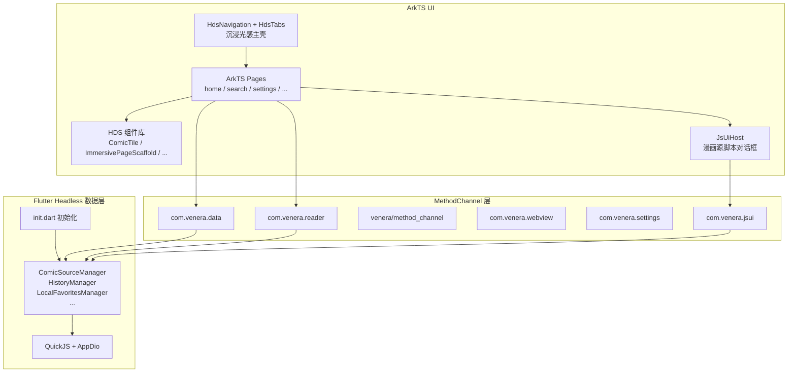

# Venera HarmonyOS

[Venera](https://github.com/venera-app/venera) 漫画阅读器的 HarmonyOS 移植版。默认使用 **ArkTS/ArkUI 原生 UI**（HarmonyOS 6.1 API 23 沉浸光感材质），Flutter 以 headless 模式提供数据层（QuickJS 漫画源、SQLite、Dio、Manager 单例）。设置中可将 `useNativeUi` 设为 `false` 回退至 Flutter Material UI。

**应用标识**：`bundleName` 为 `com.venera.ohos`，版本 `0.1.0`（见 [`app.json5`](apps/app_ohos/ohos/AppScope/app.json5)）。

## 功能特性

- 多源漫画浏览与搜索
- 漫画阅读器（6 种阅读模式：画廊左右/右左/上下、连续上下/左右/右左）
- 内置 WebView（支持 Cloudflare 验证绕过）
- 生物认证 / 密码锁（人脸识别 / 指纹识别 + PIN 回退）
- 漫画下载与本地管理
- 收藏与阅读历史
- WebDAV 数据同步
- 动态配色 / 主题切换
- 多语言支持（中文简繁、英文）

## 分支策略

| 分支 | 用途 |
|------|------|
| `main` | 稳定线，Flutter UI + 数据层混合架构 |
| `HDS_UI` | ArkUI 1:1 迁移开发分支（**迁移已完成**，待合并至 `main`） |

```bash
git checkout main      # 稳定版（Flutter UI）
git checkout HDS_UI    # 原生 UI 开发线（ArkUI + HDS）
```

远程仓库：[https://github.com/Twopuding/venera-harmony](https://github.com/Twopuding/venera-harmony)

## 迁移状态

ArkUI 全量 UI 迁移已在 `HDS_UI` 分支完成；`useNativeUi` 默认为 `true`。

| 阶段 | 内容 | 状态 |
|------|------|------|
| Phase 0 | Flutter headless 入口、`DataBridge` 双端桥接、Reader 桥接、`HdsTheme` 设计系统 | ✅ |
| Phase 1 | `MainShell` 主壳；Home / Explore / Search / ComicDetails / Reader 核心路径 | ✅ |
| Phase 2 | 收藏、分类、本地、历史、图片收藏 | ✅ |
| Phase 3 | 设置、认证、漫画源、WebView | ✅ |
| Phase 4 | 默认原生 UI、文档与回归测试 | ✅ |

详细验收记录见 [docs/PARITY_REPORT.md](docs/PARITY_REPORT.md)；手动回归清单见 [docs/PARITY_CHECKLIST.md](docs/PARITY_CHECKLIST.md)。

## 快速开始

### 前置条件

| 项目 | 版本要求 |
|------|----------|
| Flutter ohos SDK | `3.22.4-ohos-1.1.4-beta` |
| Dart SDK | `>=3.4.4 <4.0.0` |
| DevEco Studio | `>=5.0` |
| HarmonyOS SDK | `>=5.0.0(12)`，target `6.1.0(23)` |
| Node.js | `>=16.x` |

Flutter ohos SDK 安装请参考 [flutter_ohos 官方文档](https://gitee.com/openharmony-sig/flutter_flutter)。

### 1. 克隆仓库

```bash
git clone https://github.com/Twopuding/venera-harmony.git
cd venera-harmony
git checkout HDS_UI   # 或 main
```

### 2. 安装 Dart 依赖

```bash
cd apps/app_ohos
flutter pub get
```

### 3. 配置本地构建属性

复制 [`local.properties.example`](apps/app_ohos/ohos/local.properties.example) 为 `apps/app_ohos/ohos/local.properties`，按本机路径填写 `hwsdk.dir`、`flutter.sdk` 及版本号。该文件已被 `.gitignore` 忽略。

### 4. 配置签名

1. 用 DevEco Studio 打开 `apps/app_ohos/ohos/`
2. **File → Project Structure → Signing Configs**
3. 勾选 **Automatically generate signature**
4. 确认 bundleName 为 `com.venera.ohos`
5. Apply → OK

### 5. 构建与运行

推荐使用 `devecocli`（DevEco CLI）：

```bash
cd apps/app_ohos/ohos
devecocli build
devecocli run
```

备选：Flutter 直接构建 HAP：

```bash
cd apps/app_ohos
flutter build hap --debug
hdc install build/ohos/hap/entry-default-signed.hap
```

## 架构

`EntryAbility` 继承 `FlutterAbility`，保证 Flutter Engine 与 FFI（sqlite3 / qjs）生命周期。启用原生 UI 时，Dart 侧以 headless 模式运行，仅注册 MethodChannel Handler，不渲染 Material UI。



| 层级 | 技术 | 职责 |
|------|------|------|
| UI（默认） | ArkTS / ArkUI + HDS | 全部页面、沉浸光感主壳、原生组件库 |
| UI（回退） | Flutter (Dart) | `useNativeUi = false` 时渲染 Material UI |
| 数据层 | Flutter (Dart) | 漫画源管理、搜索、下载、设置、SQLite、QuickJS |
| 阅读器 | 原生 ArkTS | 6 种阅读模式、手势交互、沉浸式全屏 |
| WebView | 原生 ArkTS | Cloudflare 验证、Cookie 提取 |
| 设置 / 认证 | 原生 ArkTS | 生物认证、文件选择、屏幕常亮 |
| JS 引擎 | QuickJS (C/FFI) | 漫画源脚本执行 |
| 数据存储 | SQLite3 (C/FFI) | 本地数据库 |
| 通信 | MethodChannel | ArkTS ↔ Dart 双向调用 |

### 原生 Ability

| Ability | 用途 |
|---------|------|
| `EntryAbility` | 主入口，Flutter Engine + ArkUI 主壳 |
| `ReaderAbility` | 独立阅读器全屏窗口 |
| `WebViewAbility` | 漫画源 WebView 登录 / Cloudflare |
| `SettingsAbility` | 设置相关独立窗口 |

### HDS 设计系统

基于 `@kit.UIDesignKit`（API 23）：

- **主壳**：`HdsNavigation` + `HdsTabs`，`barFloatingStyle` + `systemMaterialEffect`
- **页面脚手架**：`ImmersivePageScaffold`、`ImmersiveScrollTopInset`
- **材质**：默认 `ADAPTIVE`；设备不支持 `IMMERSIVE` 时降级为 `SMOOTH`
- **主题**：[`HdsTheme.ets`](apps/app_ohos/ohos/entry/src/main/ets/design/HdsTheme.ets) 对齐 Flutter `SeedColorScheme` 与系统 `$r('sys.color.*')`
- **组件**：`ComicTile`、`ComicGrid`、`SearchBar`、`BlurCard`、`SettingsList`、`JsUiHost` 等

### 通信通道

| 通道名 | 方向 | 用途 |
|--------|------|------|
| `com.venera.data` | ArkTS → Dart | 统一数据 API（探索、搜索、收藏、历史、下载、设置等） |
| `com.venera.data/events` | Dart → ArkTS | 事件推送（`settingsChanged`、`downloadProgress` 等） |
| `com.venera.reader` | ArkTS ↔ Dart | 阅读器数据加载、章节图片、历史更新 |
| `com.venera.webview` | Dart → ArkTS | 打开 WebView |
| `com.venera.settings` | Dart ↔ ArkTS | 认证、文件选择、屏幕控制 |
| `com.venera.jsui` | Dart → ArkTS | 漫画源脚本 UI（对话框、输入框、选择器、加载提示） |
| `venera/method_channel` | Dart ↔ ArkTS | 通用平台服务（URL 打开、分享、电量、代理等） |

ArkTS 侧通过 [`DataService.ets`](apps/app_ohos/ohos/entry/src/main/ets/service/DataService.ets) 封装 Promise 风格 API；Dart 侧 Handler 注册于 [`native_ui_bootstrap.dart`](apps/app_ohos/lib/bridge/native_ui_bootstrap.dart)。

## 生物认证

基于 HarmonyOS `@kit.UserAuthenticationKit` 实现：

- **权限**：`ohos.permission.ACCESS_BIOMETRIC`（system_grant）
- **认证流程**：首选人脸或指纹（ATL2），失败或取消时回退 PIN（ATL1）
- **API**：`getUserAuthInstance(AuthParam, WidgetParam)`（API 10+）

## 项目结构

```
venera-harmony/
├── apps/
│   └── app_ohos/                  # Flutter 主项目
│       ├── pubspec.yaml
│       ├── lib/                   # Dart 代码
│       │   ├── main.dart          # 入口（OHOS + useNativeUi → headless）
│       │   ├── headless.dart      # headless 模式入口
│       │   ├── init.dart          # 初始化流程
│       │   ├── bridge/            # MethodChannel Dart 侧
│       │   ├── services/          # 无 UI 业务逻辑
│       │   ├── foundation/        # 核心基础
│       │   ├── network/           # 网络层
│       │   ├── pages/             # Flutter 页面（useNativeUi=false 时使用）
│       │   └── components/
│       ├── assets/
│       ├── stubs/                 # 桩插件包
│       └── ohos/                  # HarmonyOS 工程
│           ├── AppScope/
│           ├── entry/src/main/ets/
│           │   ├── entryability/       # EntryAbility
│           │   ├── readerability/      # ReaderAbility
│           │   ├── webviewability/     # WebViewAbility
│           │   ├── settingsability/    # SettingsAbility
│           │   ├── bridge/             # DataBridge, JsUiBridge, ...
│           │   ├── design/             # HdsTheme
│           │   ├── service/            # DataService
│           │   ├── navigation/         # RouterUtil, NavigationMenus
│           │   ├── pages/              # Index, MainShell, home/, search/, settings/, ...
│           │   ├── components/         # ImmersivePageScaffold, JsUiHost, ...
│           │   ├── viewmodel/
│           │   └── utils/
│           ├── build-profile.json5
│           └── local.properties.example
├── docs/                          # 验收与回归文档
│   ├── PARITY_REPORT.md
│   └── PARITY_CHECKLIST.md
├── plugins/
│   └── flutter_qjs/               # QuickJS FFI 插件
└── scripts/
    └── sanitize-build-profile.ps1 # 提交前签名脱敏脚本
```

## 与上游 Venera 的关系

本项目基于 [venera-app/venera](https://github.com/venera-app/venera) v1.6.3 进行 HarmonyOS 移植，主要变更：

- **ArkUI 迁移**：UI 全量 1:1 迁移至 ArkTS，Flutter 退居 headless 数据层
- **HDS 沉浸光感**：`HdsNavigation` / `HdsTabs` / `hdsMaterial` 主壳与组件材质
- **DataBridge**：统一 ArkTS ↔ Dart 数据通道
- **JsUiBridge**：漫画源脚本原生对话框 UI
- **混合架构**：4 个原生 ArkTS Ability（Entry / Reader / WebView / Settings）
- **平台适配**：OhosHttpClientAdapter、OhosPathProvider
- **插件替换**：7zip → Process、lodepng → image、zip_flutter → archive
- **QuickJS FFI**：为 HarmonyOS ARM64 编译的 QuickJS .so

## 贡献者：安全提交

推送至 GitHub 前，必须对 [`build-profile.json5`](apps/app_ohos/ohos/build-profile.json5) 进行签名脱敏，且**不得提交** HAP 等构建产物。

### 脱敏流程

```powershell
# 1. 检查状态（应为 REAL，无残留 backup）
powershell -ExecutionPolicy Bypass -File scripts/sanitize-build-profile.ps1 status

# 2. 备份并脱敏
powershell -ExecutionPolicy Bypass -File scripts/sanitize-build-profile.ps1 sanitize

# 3. git add / commit / push（见下方禁止项）

# 4. 无论 commit/push 成败，立即还原本地证书
powershell -ExecutionPolicy Bypass -File scripts/sanitize-build-profile.ps1 restore
powershell -ExecutionPolicy Bypass -File scripts/sanitize-build-profile.ps1 verify
powershell -ExecutionPolicy Bypass -File scripts/sanitize-build-profile.ps1 cleanup
```

### 禁止提交

| 类型 | 示例 |
|------|------|
| HAP / APP 包 | `**/*.hap`、`**/*.app` |
| 构建目录 | `build/`、`.hvigor/`、`.dart_tool/` |
| Flutter 鸿蒙产物 | `flutter_assets/`、`libapp.so` |
| 签名备份 | `build-profile.json5.local.bak`、`.sha256` |
| 本地配置 | `local.properties`、`.p12`、`.p7b`、`.cer` |

提交前执行 `git status` 与 `git diff --cached --name-only` 确认 staged 列表无上述文件。

## 文档

| 文档 | 说明 |
|------|------|
| [docs/PARITY_REPORT.md](docs/PARITY_REPORT.md) | ArkUI vs Flutter 功能验收报告 |
| [docs/PARITY_CHECKLIST.md](docs/PARITY_CHECKLIST.md) | 手动回归测试清单 |

## 致谢

- [Venera](https://github.com/venera-app/venera) - 原始项目
- [Flutter ohos SDK](https://gitee.com/openharmony-sig/flutter_flutter) - Flutter HarmonyOS 支持
- [QuickJS](https://bellard.org/quickjs/) - JavaScript 引擎
